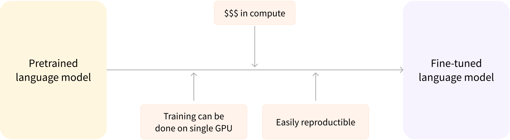

# Chapter 1 - Transformer Models

# **What is NLP?**

- NLP is a field of linguistics and machine learning focused on **understanding everything related to human language**.
- The aim of NLP tasks is **not only to understand single word**s individually, but to be able to **understand the context** of those words.

### Applications of NLP

- **Classifying whole sentences**:
    - Getting the sentiment of a review, detecting if an email is spam, determining if a sentence is grammatically correct or whether two sentences are logically related or not
- **Classifying each word in a sentence**:
    - Identifying the grammatical components of a sentence (noun, verb, adjective), or the named entities (person, location, organization)
- **Generating text content**:
    - Completing a prompt with auto-generated text, filling in the blanks in a text with masked words
- **Extracting an answer from a text**:
    - Given a question and a context, extracting the answer to the question based on the information provided in the context
- **Generating a new sentence from an input text**:
    - Translating a text into another language, summarizing a text

## Pipeline function

- **Links**
    - **Colab Notebook:** [Transformers, what can they do?](https://colab.research.google.com/github/huggingface/notebooks/blob/master/course/en/chapter1/section3.ipynb)
    - **HuggingFace Transformers library:** ‣
- The most basic object in the Transformers library
- Connects a model with its necessary **preprocessing** and **postprocessing steps**

**Example** (for Sentiment Analysis)**:**

```python
from transformers import pipeline
classifier = pipeline("sentiment-analysis")
classifier([
	"I've been waiting for a HuggingFace course my whole life.", 
	"I hate this so much!"
])

Output: 
[{'label': 'POSITIVE', 'score': 0.9598047137260437},
 {'label': 'NEGATIVE', 'score': 0.9994558095932007}]
```

**Steps:**

- The pipeline selects a particular **pretrained model** that has been fine-tuned for sentiment analysis in English
- The model is **downloaded** and **cached** when you create the `classifier` object
    - If you rerun the command, the cached model will be used instead and there is no need to download the model again
- The text is preprocessed into a format the model can understand
- The preprocessed inputs are passed to the model
- The predictions of the model are post-processed, so you can make sense of them

### ****************************************Available Pipelines:****************************************

- **feature-extraction**
    - Generates a vector representation of a text
- **fill-mask**
    - Similar to *text-generation*, but it generates text to fill a blank on a text
        - Ex: "This course will teach you all about `<mask>`models."
- **ner**
    - Named Entity Recognition
    - Find which parts of the input text correspond to entities such as persons, locations, or organizations
- **question-answering**
    - Answers questions using information from a given context
- **sentiment-analysis**
- **summarization**
    - Reducing a text into a shorter text while keeping all (or most) of the important aspects referenced in the text
- **text-generation**
    - You provide a prompt and the model will auto-complete it by generating the remaining text
- **translation**
- **zero-shot-classification**
    - Allows you to classify text according to “new” labels (on which the model hasn’t been specifically trained to)
        - So you don’t have to rely on the labels of the pretrained model.
    - This pipeline is called *zero-shot* because **you don’t need to fine-tune the model on your data** to use it

### Model Hub

- The previous examples used a default model from Hugging Face
- The [Model Hub](https://huggingface.co/models) contains many other models, fine-tuned for specific contexts or for other tasks

# Transformers

- The **[Transformer architecture](https://arxiv.org/abs/1706.03762)** was introduced in June 2017.
    - The focus of the original research was on translation tasks.
- They are broadly grouped into 3 categories:
    - **GPT-like** (also called *auto-regressive* Transformer models)
    - **BERT-like** (also called *auto-encoding* Transformer models)
    - **BART/T5-like** (also called *sequence-to-sequence* Transformer models)
- **Transformers are language models**
    - They have been trained on **large amounts of raw text** in a **self-supervised** fashion
        - Self-supervised learning is a type of training in which the **objective is automatically computed** from the inputs of the model.
        - That means that humans are not needed to label the data!
    - This type of model develops a **statistical understanding of the language** it has been trained on
        - but it’s not very useful for specific practical tasks.
        - The general pretrained model then goes through a process called ***transfer learning*.**
        - During this process, **the model is fine-tuned in a supervised way** — that is, using human-annotated labels — on a given task.
- **Transformers are big models**
    - The general strategy to achieve better performance is by **increasing the models’ sizes** as well as the **amount of data they are pretrained on.**
    - Training a model requires a large amount of data.
    - This becomes **very costly in terms of time and compute resources**.
    - It even translates to environmental impact
    - This is why **sharing language models is paramount**
        - sharing and building on top of already trained weights reduces the overall compute cost and carbon footprint of the community.
- **Transfer Learning**
    - Transfer Learning is the act of **initializing a model with another model’s weights**
    - It greatly reduces the time spent in training
    - But it also reproduces the same bias existing in the pretraining
- **Pretraining**
    - *Pretraining* is the act of training a model from scratch
        - the **weights are randomly initialized**, and the training **starts without any prior knowledge**.
    - Usually done on **very large amounts of data**
    - Requires a very large corpus of data, and training can take up to several weeks.
- **Fine-tuning**
    - *Fine-tuning*, on the other hand, is the **training done after a model has been pretrained**.
    - To perform fine-tuning, you first acquire a pretrained language model, then perform additional training with a dataset specific to your task.
    - Why not simply train directly for the final task?
        - The fine-tuning dataset usually has some similarities with the pretraining dataset
        - Fine-tuning takes advantage of knowledge acquired during pretraining
            - Ex: with NLP problems, the pretrained model will have some kind of statistical understanding of the language you are using for your task
        - Fine-tuning a model has **lower time, data, financial, and environmental costs.**
        - It is also **quicker and easier to iterate over different fine-tuning schemes**, as the training is less constraining than a full pretraining.



## Transformer Architecture

- The model is primarily composed of two blocks:
    - **Encoder**:
        - The encoder **receives an input and builds a representation** of it (features or embeddings).
        - This means that the model is **optimized to acquire understanding** from the input.
        - Bi-directional, with self-attention
    - **Decoder**:
        - The decoder **uses the encoder’s representation** (features) along with other inputs to **generate a target sequence**.
        - This means that the model is **optimized for generating outputs.**
        - Uni-directional, auto-regressional, with masked self-attention


- Each of part can be used independently, depending on the task:
    - **Encoder-only models**:
        - Good for **tasks that require understanding of the input**, such as sentence classification and named entity recognition.
    - **Decoder-only models**:
        - Good for **generative tasks** such as text generation.
    - **Encoder-decoder models** or **sequence-to-sequence models**:
        - Good for **generative tasks that require an input**, such as translation or summarization.

### Attention Layers

- Key feature of transformer models
- This layer will tell the model to **pay specific attention to certain words** in the sentence you passed it
    - And more or less ignore the others when dealing with the representation of each word.
    - A word by itself has a meaning, but that meaning is deeply affected by the context, which can be any other word in the text

### **The original architecture**

- The Transformer architecture was originally designed for translation.
- During training, the encoder receives inputs (sentences) in a certain language, while the decoder receives the same sentences in the desired target language.
    - In the encoder, the attention layers can use all the words in a sentence.
    - The decoder, however, works sequentially and can only pay attention to the words in the sentence that it has already translated
    - For example, when we have predicted the first three words of the translated target, we give them to the decoder which then uses all the inputs of the encoder to try to predict the fourth word.
- To speed things up during training, the decoder is fed the whole target, but it is not allowed to use future words
    - For instance, when trying to predict the fourth word, the attention layer will only have access to the words in positions 1 to 3.
- Note that the **first attention layer** in a decoder block pays **attention to all (past) inputs** to the decoder, but the **second attention layer uses the output of the encoder**
    - It can thus access the whole input sentence to best predict the current word.
    - This is very useful as different languages can have grammatical rules that put the words in different orders, or some context provided later in the sentence may be helpful to determine the best translation of a given word.
- The *attention mask* can also be used in the encoder/decoder to prevent the model from paying attention to some special words — for instance, the special padding word used to make all the inputs the same length when batching together sentences.


- Important terms:
    - **Architecture**:
        - This is the skeleton of the model — the **definition of each layer and each operation** that happens within the model.
    - **Checkpoints**:
        - These are the **weights** that will be loaded **in a given architecture.**
    - **Model**:
        - This is an **umbrella term** that isn’t as precise as “architecture” or “checkpoint”: it can mean both

### Encoder models

- Family of models that use **only the encoder**
- The encoder **outputs a numerical representation for each word** used as input
    - It uses the **self-attention mechanism**
    - Each word in the initial sequence **affects every word’s** representation

### Decoder models

- Family of models that use **only the decoder**
    - These models are often called *auto-regressive models*, because they **reuse their past outputs** as inputs in the following steps
- The decoder also **outputs a numerical representation for each word** used as input
    - It uses **masked self-attention**
    - For a given word, the attention layers **can only access the words positioned before** it in the sentence.
        - The right side is hidden (mask)
- The pretraining of decoder models usually revolves around predicting the next word in the sentence.

### Encoder-decoder ****models****

- Family of models that use both parts of the Transformer architecture
    - Also called *sequence-to-sequence models*
    - The attention layers of the encoder can access all the words in the initial sentence, whereas the attention layers of the decoder can only access the words positioned before a given word in the input.
- They can be built from separate encoders and decoders
- How it works:
    - The encoder receives the input and generates its output
    - The decoder is fed with a *****************start of sequence***************** word, and with the encoder output
    - The decoder outputs the first word from its output (WORD_1)
    - WORD_1 is then fed back to the decoder, and it’s processed along with the *****************start of sequence***************** and the encoder output
    - Then it generates WORD_2, and the cycle repeats until a ***************end of sequence*************** word is output by the decoder
- These models are best suited for tasks revolving around **generating new sentences depending on a given input**

### **Models Summary**

| Model | Examples | Tasks |
| --- | --- | --- |
| Encoder | ALBERT, BERT, DistilBERT, ELECTRA, RoBERTa | Sentence classification, named entity recognition, extractive question answering |
| Decoder | CTRL, GPT, GPT-2, Transformer XL | Text generation |
| Encoder-decoder | BART, T5, Marian, mBART | Summarization, translation, generative question answering |