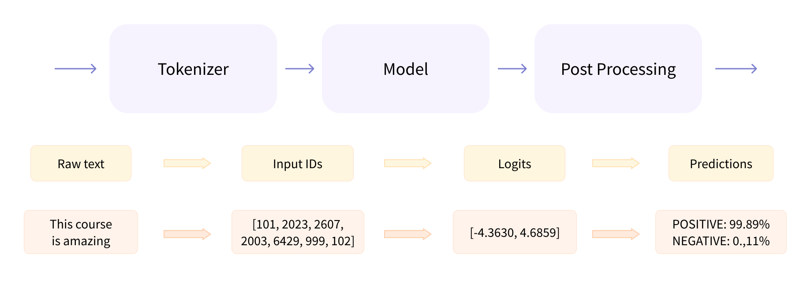
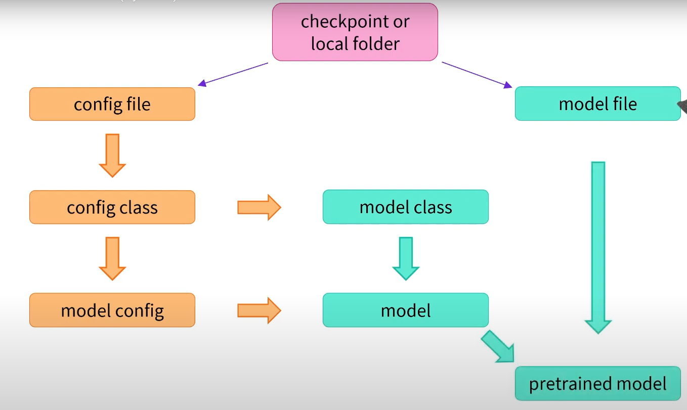

# Chapter 2 - Using Transformers

# Behind the Pipeline

- The Pipeline has three stages:
    
    
    

### **Tokenizer**

- Converts raw texts into numbers the model can make sense of
- Steps:
    - The text is split into chunks called ******tokens******
    - Add special tokens, e.g. to indicate beginning and end of sentence
    - Each token is replaced by a unique ID from the pretrained vocabulary
- Sample code
    
    ```python
    from transformers import AutoTokenizer
    
    checkpoint = "distilbert-base-uncased-finetuned-sst-2-english"
    tokenizer = AutoTokenizer.from_pretrained(checkpoint)
    raw_inputs = [
        "I've been waiting for a HuggingFace course my whole life.",
        "I hate this so much!",
    ]
    inputs = tokenizer(
    	raw_inputs, padding=True, truncation=True, return_tensors="pt"
    )
    print(inputs)
    ```
    

### **Model**

- Uses the tokenizer outputs as inputs, and outputs a vector o *logits*
- `AutoModel`:
    
    ```python
    from transformers import AutoModel
    
    checkpoint = "distilbert-base-uncased-finetuned-sst-2-english"
    model = AutoModel.from_pretrained(checkpoint)
    
    outputs = model(**inputs)
    print(outputs.last_hidden_state.shape)
    ```
    
    - This architecture contains only the base Transformer module:
        - Given some inputs, it outputs what we’ll call ***hidden states***, also known as *features*.
    - For each model input, we’ll retrieve a high-dimensional vector representing the **contextual understanding of that input by the Transformer model**.
    - While these hidden states can be useful on their own, they’re **usually inputs to another part of the model**, known as the ***head***.
        - Different tasks can be performed with the same architecture, but **each task needs a different head** associated with it.
    - The vector output is usually **large**, and generally has three dimensions:
        - **Batch size**: The number of sequences processed at a time
        - **Sequence length**: The length of the numerical representation of the sequence
        - **Hidden size**: The vector dimension of each model input
            - The hidden size can be very large!
                - 768 is common for smaller models; in larger models this can reach 3072 or more
    - The output of the Transformer model is sent directly to the model *head* to be processed.
- `AutoModelForSequenceClassification`
    
    ```python
    from transformers import AutoModelForSequenceClassification
    
    checkpoint = "distilbert-base-uncased-finetuned-sst-2-english"
    model = AutoModelForSequenceClassification.from_pretrained(checkpoint)
    outputs = model(**inputs)
    print(outputs.logits.shape)
    ```
    
    - This example has a ***sequence classification head***
    - Its outputs have much **lower dimensionality**
        - The model head receives the high-dimensional vectors from AutoModel, and outputs vectors containing one value per label
- **Full model representation:**


### **Postprocessing**

- Receives the logits, interpret then according to the desired task, and then return the predictions
    - ***Logits*** are raw, unnormalized scores outputted by the last layer of the model
    - They must go through a **[SoftMax](https://en.wikipedia.org/wiki/Softmax_function)** layer to be converted to probabilities

```python
import torch

predictions = torch.nn.functional.softmax(outputs.logits, dim=-1)
print(predictions)

Output: tensor(
	[[4.0195e-02, 9.5980e-01], [9.9946e-01, 5.4418e-04]],
	grad_fn=<SoftmaxBackward>
)
```

- To get the labels corresponding to each position, we can inspect the `model.config.id2label` attribute

# Transformer Models

- The AutoModel API can either get a checkpoint from Model Hub by its name, or import from a local file
    - If checking on Model Hub, it will download and cache it locally
    - It uses two main files: **config file** and **model file**
- **Config file**
    - Contains the config class and model class for instantiating the model
        - Its format depends on the model architecture (BERT, GPT, etc)
    - The instantiated model has the expected architecture, but has random weights
- **Model file**
    - Contains the pretrained weights, to be loaded onto the instantiated model
    
    
    

# Tokenizers

- Translate text into data that can be processed by the model

### Word-based Tokenization

- Split the raw text into **words** and find a **numerical representation** for each of them
- The vocabulary can become very large!
    - English has around 500k words
    - You can select only a slice of the most common words (ex: 10k), but it will result in loss of information

### Character-based Tokenization

- Split the text into characters, for two primary benefits
    - The vocabulary is much smaller.
    - Much fewer out-of-vocabulary (unknown) tokens
- Effectiveness varies according do language
    - Chinese characters have more meaning than latin chars
- Requires a much higher amount of tokens to be processed

### Subword Tokenization

- Strategy in between the methods above
- Decompose “rare” words into meaningful subwords
    - Ex: “tokenization” → “token” + “ization”
- Most models obtaining state-of-the-art results in English today use some kind of subwords tokenization
- Examples:
    - Byte-level BPE, as used in GPT-2
    - WordPiece, as used in BERT
    - SentencePiece or Unigram, as used in several multilingual models

## Usage

- Loading and saving tokenizers is as simple as it is with models: `from_pretrained()` and `save_pretrained()`.

```python
from transformers import BertTokenizer, AutoTokenizer

# Both ways work to instanatiate
tokenizer = BertTokenizer.from_pretrained("bert-base-cased")
tokenizer = AutoTokenizer.from_pretrained("bert-base-cased")

tokenizer("Using a Transformer network is simple")
**Output: {
	'input_ids': [101, 7993, 170, 11303, 1200, 2443, 1110, 3014, 102],
	'token_type_ids': [0, 0, 0, 0, 0, 0, 0, 0, 0],
	'attention_mask': [1, 1, 1, 1, 1, 1, 1, 1, 1]
}**

tokens = tokenizer.tokenize(sequence)
print(tokens)
**Output: ['Using', 'a', 'transform', '##er', 'network', 'is', 'simple']**

ids = tokenizer.convert_tokens_to_ids(tokens)
print(ids)
**Output: [7993, 170, 11303, 1200, 2443, 1110, 3014]**

decoded_string = tokenizer.decode([7993, 170, 11303, 1200, 2443, 1110, 3014])
print(decoded_string)
**************Output: 'Using a Transformer network is simple'**************
```

### Batching sequences

- We can’t build a tensor with different length!
- Truncating is possible but results in loss of information
    - Only used when the sentence is too big (and not supported)
- Usual strategy is to **pad the smaller sentences** to the longest length
    - Add [PAD] tokens to smaller sentences
    - However, the attention mechanism usually checks all the tokens, but doing so would result in it analyzing the [PAD] tokens (which is not recommended)
        - To avoid this issue, we must use the `attention_mask`
            - Binary tensors indicating which tokens must be checked by the attention
            - This is done if you use `padding=True`